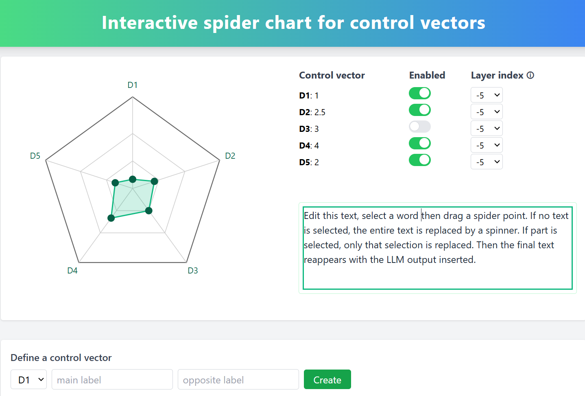

# Control-Vectors-Dashboard
Interactive radar (spider) chart in D3, allowing 0.5-increment drags. 
It includes a live text replacement system, where selected text is replaced by the computed output string that comes via the FastAPI backend.

Users can define `control vectors` and carefully apply them with toggles, layer indices, and dimension renaming through a simulated backend process.

This project draws inspiration from [Theia Vogel's work on representation engineering](https://vgel.me/posts/representation-engineering/) and the ideas explored in the [RepEng GitHub repository](https://github.com/vgel/repeng/).

